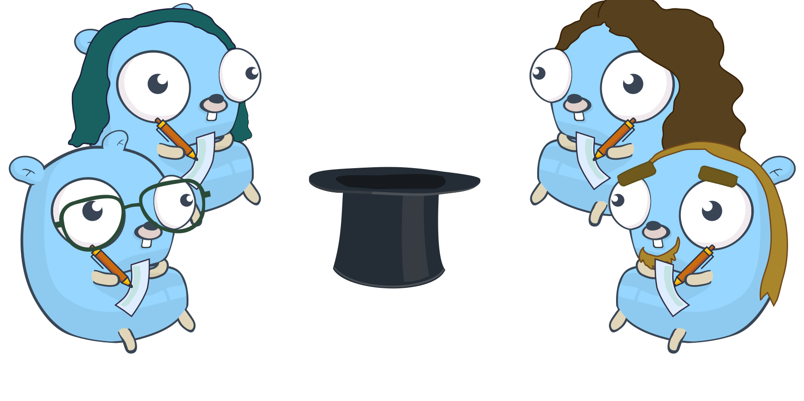
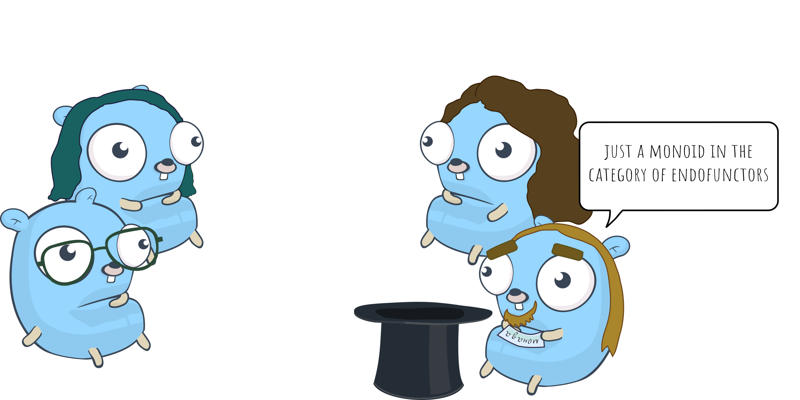
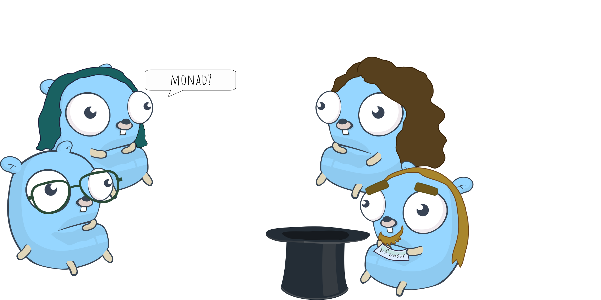
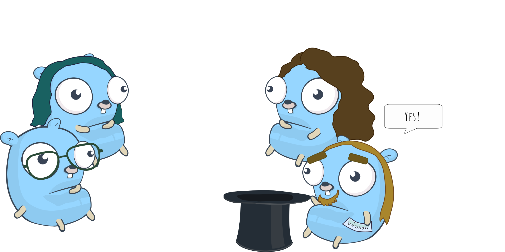
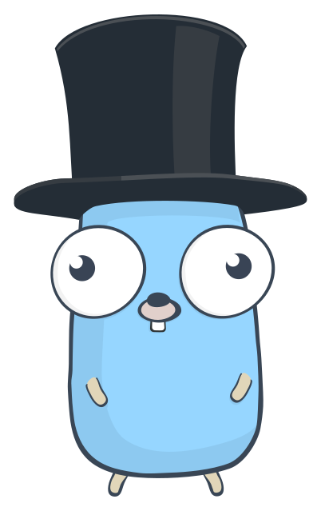

## Листчета (Hatgame)

### How do you play the game in real life?

First everyone writes words. Each word (phrase or name) is written on a piece of paper which is then folded and
you usually write around 10 words each.

Those words are put into a hat (or another container).

The players are then separated into teams of two and take turns to explain words taken from the hat to their partner.
Usually the active team changes clockwise and one of the people in the team is the storyteller while the other one tries to guess. The storyteller picks a word from the hat at random and proceeds to explain it to their partner without saying the word from the paper
or its translations. The same rules as in word association apply. The team has one minute to explain as many words as possible. After the timer is done it's the next team's turn.

After the last word is explained the game is over. The last storyteller puts the hat on their head and
the winner is the team who's managed to explain the most words.

